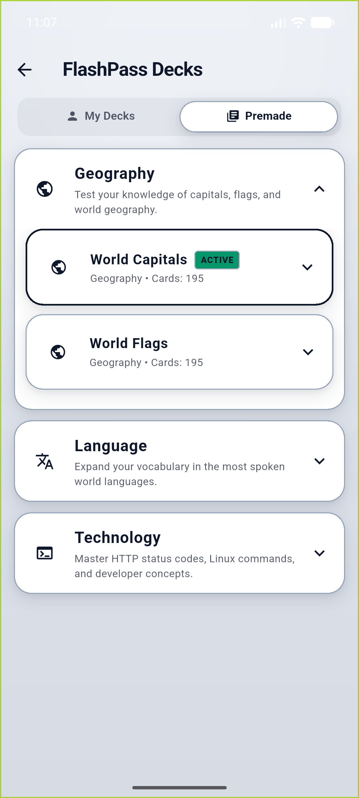
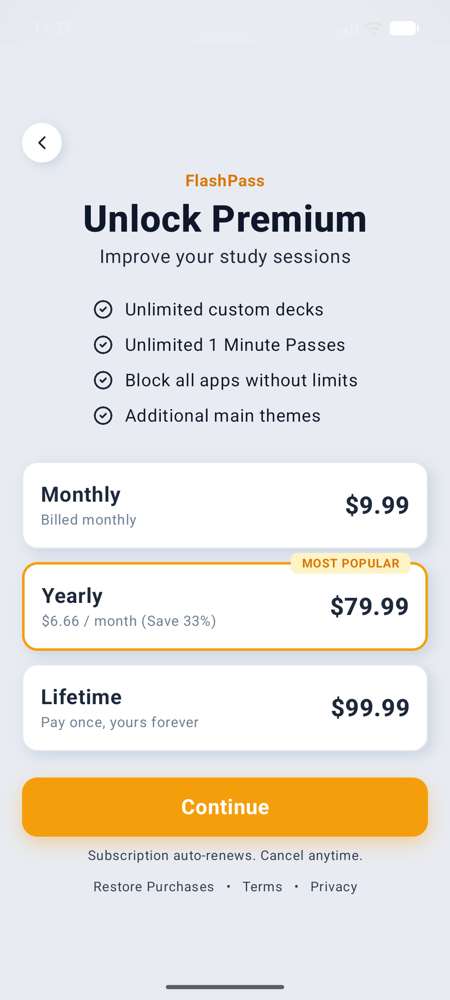
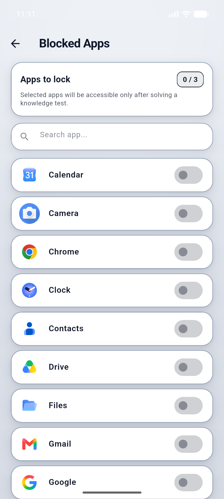
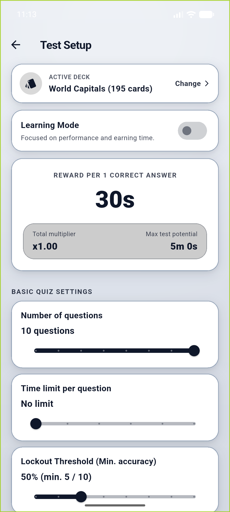
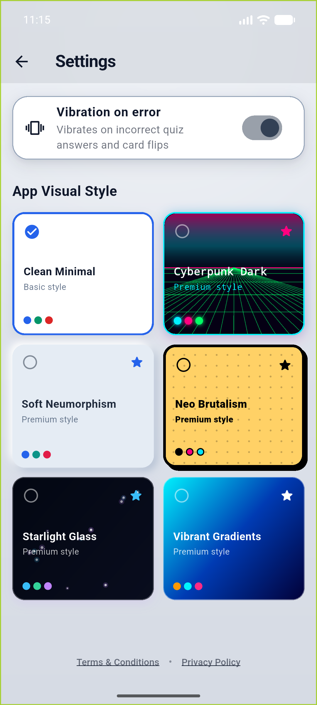

# ⚡ FlashPass

  

  

    <strong>Unlock addictive apps with your own knowledge. Swap mindless doomscrolling for micro-learning.</strong>
  

  
  
  
  
  

   

  ⭐ Star us on GitHub: your support motivates us a lot! 🙏😊

   

  
  
  

---

## 🌟 Highlights

* 🧠 **Knowledge as Currency:** To access blocked apps (TikTok, Instagram, YouTube Shorts), answer quick flashcard prompts to earn screen time.
* ⚡ **Zero-Friction Importers:** Native bidirectional CSV parsing (supports multi-line Quizlet exports) and direct `.apkg` Anki archive import.
* 🛡️ **Unbreakable Focus Guard:** Native Android Accessibility & Foreground Overlay gating prevents impulse doomscrolling.
* 🎨 **Adaptive Design Engine:** Switch seamlessly between Neumorphic Soft, Cyberpunk Neon, and Neobrutalism UI modes.
* 💎 **RevenueCat Monetization:** In-app subscriptions backed by RevenueCat Paywalls and native Customer Center.

---

## ℹ️ Overview

**FlashPass** tackles digital screen addiction from a psychological angle: instead of relying purely on willpower or rigid blocking, it implements an **active learning tax**.

When attempting to launch a restricted app, FlashPass intercepts with an instant flashcard challenge. Solve cards correctly and return to your phone distraction-free and guilt-free.

Built natively in Flutter for the **RevenueCat Shipaton 2026**.

---

## 📱 Screenshots & UI

| Dashboard & Goal Tracker | Deck Management | Native RevenueCat Paywall |
|:---:|:---:|:---:|
|  |  |  |

| App Selector | Test Setup & Overlays | Themes Preview |
|:---:|:---:|:---:|
|  |  |  |

---

## 🚀 How It Works

1. **Pick your distractions:** Select apps to lock in the **Blocked Apps** tab.
2. **Choose your deck:** Use pre-made sets (Geography, Tech, Languages) or import your custom Anki/Quizlet CSV decks.
3. **Earn your screen time:** Answer 3–5 flashcards to unlock minutes of uninterrupted phone usage.

---

## 📲 Download

  

  
<em>🚀 Google Play release is currently in closed testing / review.</em>

---

## ✨ Key Features

* **App Blocker Engine:** Built using Android Accessibility Service and System Alert Overlay permissions for reliable interception.
* **Pre-made Starter Decks:** Curated collections in Geography, Tech/IT (Linux commands, HTTP status codes, Haskell), and Languages.
* **Gamification & Daily Challenges:** Animated streaks, dynamic mastery metrics, and daily goal missions.
* **Theme Match:** Clean Neumorphic interface custom-tailored to harmonize with modern RevenueCat Paywall components.

---

## ✍️ Author & Credits

Created by **[Peter Žukovský]** ([@zuky05](https://github.com/zuky05)) and **[Viktor Slašťan]** ([@ViktorSlastan](https://github.com/ViktorSlastan)) for the **RevenueCat Shipaton 2026**.

* Special thanks to the **RevenueCat team** for the Shipaton initiative and SDK support.
* Built with [Flutter](https://flutter.dev) and [SQLite](https://www.sqlite.org).

---

## 🤝 Feedback and Contributions

Whether you encountered a bug, have an idea for a feature, or want to contribute new deck presets:

* 💡 [Open an Issue](https://github.com/zuky05/flashpass/issues) or join the discussions.
* ⭐ Don't forget to star the repository if FlashPass helped you reclaim your focus!

---

## 📃 License

Distributed under the MIT License. See [LICENSE](LICENSE) for more information.

[Back to top](#top)